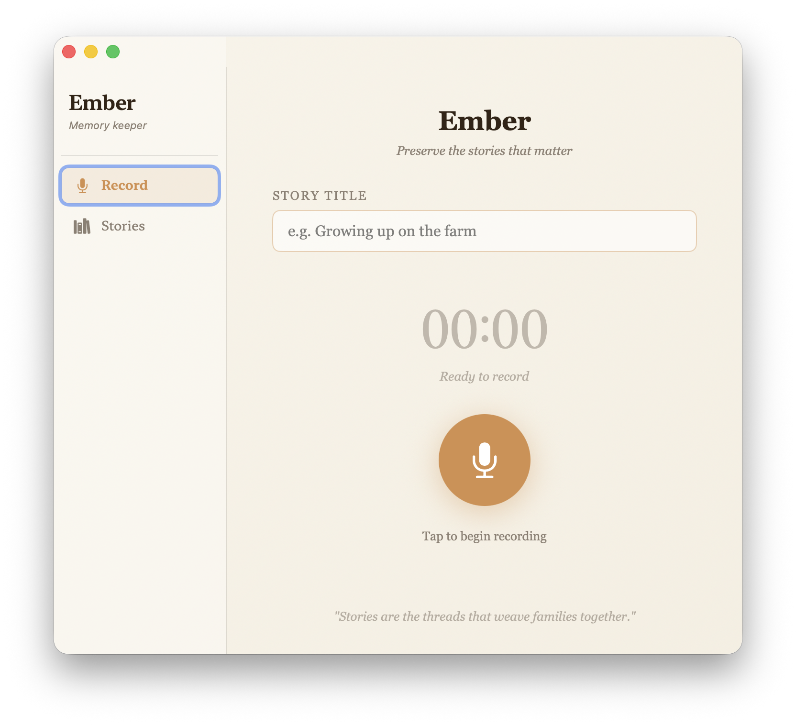
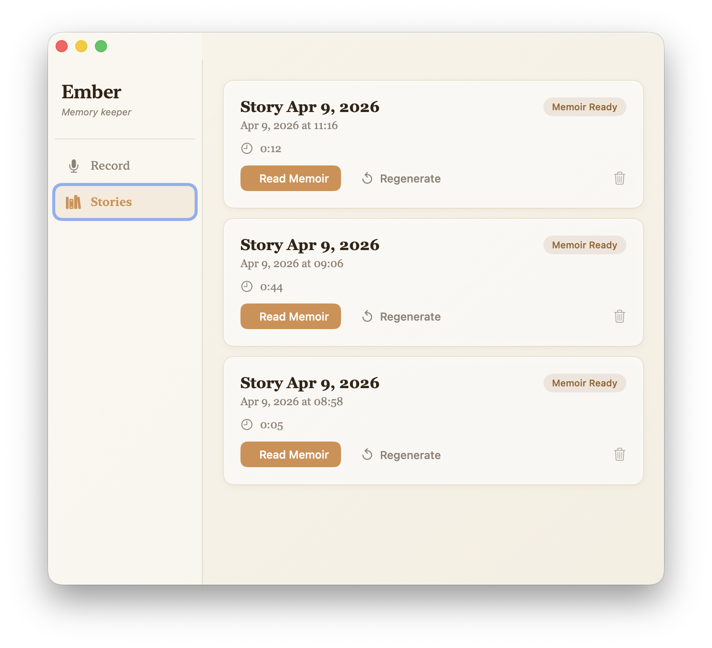

# Ember

**Record the stories of your elders. Preserve them forever.**

Ember is a macOS app for capturing audio stories from family members and loved ones, transcribing them with OpenAI Whisper, and turning the transcripts into beautifully written memoir chapters with Claude.

---

## Download the App

**[⬇ Download Ember for Mac](https://github.com/youngandai/ember/releases/download/dmg-latest/Ember.dmg)**

**Requirements:** macOS 14 (Sonoma) or later, Apple Silicon or Intel Mac.

### First-time setup

Ember uses two AI services. Before recording your first story, open **Settings (⌘,)** and add your API keys:

| Setting           | Where to get it                                                                    |
| ----------------- | ---------------------------------------------------------------------------------- |
| OpenAI API key    | [platform.openai.com/api-keys](https://platform.openai.com/api-keys)               |
| Anthropic API key | [console.anthropic.com/settings/keys](https://console.anthropic.com/settings/keys) |

Keys are saved locally on your Mac and never sent anywhere except directly to those APIs.

---

## Screenshots

<p align="center">
  
  
</p>

---

## How It Works

1. **Record** — Give your session a title, press the big amber button, and start talking. Pause or resume anytime. Press **Finish Recording** when done.
2. **Transcribe** — Click **Transcribe** on any recorded session. Ember sends your audio to OpenAI Whisper and stores the text locally.
3. **Write memoir** — Click **Write Memoir**. Claude reads the transcript and writes a first-person memoir chapter in the speaker's voice — literary, warm, and ready to keep.
4. **Export** — Read the memoir in the app, or export it as a PDF to print, share, or bind.

---

## Keyboard Shortcuts

| Shortcut | Action                      |
| -------- | --------------------------- |
| `⌘,`     | Open Settings               |
| `⌘1`     | Record                      |
| `⌘2`     | Stories                     |
| `⌘R`     | Start / Pause recording     |
| `⌘.`     | Stop recording              |
| `⌘T`     | Transcribe selected session |
| `⌘M`     | Generate memoir             |
| `⌘↩`     | View memoir                 |

---

## Build It Yourself

If you want to explore the code, add features, or just learn how it works, here's how to build from source.

**Prerequisites:**

- macOS 14+
- Xcode 16 — [download from the App Store](https://apps.apple.com/app/xcode/id497799835)
- XcodeGen — `brew install xcodegen`
- (Optional) Claude Code for AI-assisted development

**Steps:**

```bash
git clone https://github.com/youngandai/ember.git
cd ember
./build.sh
```

That's it. The script generates the Xcode project, builds the app in Release mode, and installs it to `/Applications/Ember.app`.

**To package a distributable DMG:**

```bash
./package.sh
```

This creates `Ember.dmg` in the repo root, ready to upload to GitHub Releases.

**Project layout:**

```
ember/
├── build.sh              # Build + install to /Applications
├── package.sh            # Build + create Ember.dmg
└── swift/
    ├── project.yml       # XcodeGen config
    ├── generate_icon.swift  # Regenerate app icon PNGs
    └── Ember/
        ├── Models/       # Session data model
        ├── Stores/       # Local JSON persistence
        ├── Services/     # AudioRecorder, Whisper, Claude
        └── Views/        # All SwiftUI screens
```

**Developing with Claude Code:**

This project was built with Claude Code. If you have it installed, you can keep building on it:

```bash
cd ember
claude
```

Then just describe what you want to add or change in plain English. The codebase is small and clean enough that Claude can navigate it effectively.

---

## Privacy

- All recordings and transcripts are stored **locally on your Mac** in `~/Library/Application Support/Ember/`
- Audio is sent to OpenAI only when you click Transcribe
- Transcripts are sent to Anthropic only when you click Write Memoir
- No accounts, no cloud sync, no telemetry

---

## License

MIT
